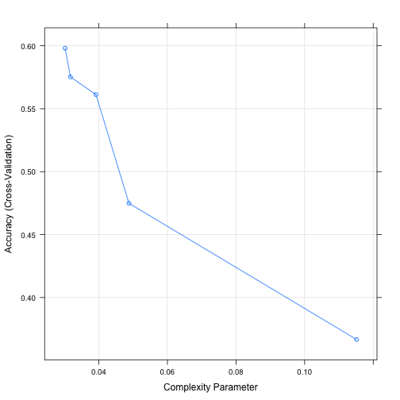
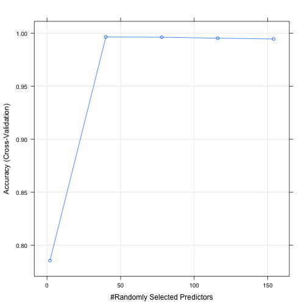

Predicting the manner in which people do their excercise using classification tree and random forest
========================================================

## Introduction

Many electronic devices enable people to collect personal activity data conveniently, which are useful for finding people's behavior pattern and improving their health. In this analysis, we use such data from 6 participants equiped with accelerometers on their belts, forearms, arms, and dumbells to predict the manner in which they did the exercise. Classification Tree and Random Forest models are fitted separately. From the results, we can conclude that Random Forest has a better performance with out of sample accuracy 99.8%. 

## Data Preprocessing

First read in the data files which have been downloaded from the working directory. 


```r
training <- read.csv("pml-training.csv")
testing <- read.csv("pml-testing.csv")
```


Then we use str and summary function to understand the basic structure of the training data. We hide the results for there are 160 variables. 


```r
str(training)
summary(training)
```


From the summary, we can see the following things:  
- The data types of most variables are numeric or integer. 
- Some variables have missing values. 
- Some variables, which should be numeric, have strange and uninterpretable values like "" and "#DIV/0!", making them factor variables. 

We need a strategy to impute these values and transform some variables into appropriate types. From the result of summary function, we can see that all the variables don't have extremely low negative values. As a result, we replace all the missing and strange values with negative number -999, which is distinguishable from normal values. 


```r
# impute missing and strange values
col1 <- sapply(1:ncol(training), function(i) {
    any(is.na(training[, i]))
})
col2 <- sapply(1:ncol(training), function(i) {
    any("" %in% training[, i] | "#DIV/0!" %in% training[, i])
})
for (i in 1:ncol(training)) {
    if (col2[i]) {
        vec <- as.character(training[, i])
        vec[vec == "" | vec == "#DIV/0!"] <- -999
        training[, i] <- as.numeric(vec)
    }
    if (col1[i]) {
        vec <- training[, i]
        vec[is.na(vec)] <- -999
        training[, i] <- vec
    }
}
```


# Results

Now we start to build our predictive model. First, we split the training data into a new training dataset and a new testing dataset, with a ratio 7:3. 


```r
library(caret)
```

```
## Loading required package: lattice
## Loading required package: ggplot2
```

```r
set.seed(1000)
inTrain <- createDataPartition(y = training$classe, p = 0.7, list = F)
myTrain <- training[inTrain, ]
myTest <- training[-inTrain, ]
```


Tree model and Random Forest model are fitted separately with 5-fold cross validation. When fitting the models, the first five columns are not used, for they represent id, usernames and time information, which are irrelavant to predicting the excercise manner.   


```r
cvControl <- trainControl(method = "cv", number = 5)
set.seed(1000)
tree.fit <- train(myTrain[, c(-1:-5, -160)], myTrain[, 160], trControl = cvControl, 
    method = "rpart", tuneLength = 5)
```

```
## Loading required package: rpart
```

```r
plot(tree.fit)
```

 

```r
set.seed(1000)
randomForest <- train(myTrain[, c(-1:-5, -160)], myTrain[, 160], trControl = cvControl, 
    method = "rf", tuneLength = 5)
```

```
## Loading required package: randomForest
## randomForest 4.6-7
## Type rfNews() to see new features/changes/bug fixes.
```

```r
plot(randomForest)
```

 


From the two plots, we can see that, using 5-fold cross validation, the estimated out of sample error rate of the Tree model is above 40%, while that of the Random Forest model is less than 1%. So we choose the best Random Forest model as our final model and apply it to our generated testing data to see how well it generalizes. 


```r
model <- randomForest$finalModel
pred.test <- predict(model, newdata = myTest)
confusionMatrix(pred.test, myTest$classe)
```

```
## Confusion Matrix and Statistics
## 
##           Reference
## Prediction    A    B    C    D    E
##          A 1674    2    0    0    0
##          B    0 1137    2    0    0
##          C    0    0 1024    4    0
##          D    0    0    0  960    3
##          E    0    0    0    0 1079
## 
## Overall Statistics
##                                         
##                Accuracy : 0.998         
##                  95% CI : (0.997, 0.999)
##     No Information Rate : 0.284         
##     P-Value [Acc > NIR] : <2e-16        
##                                         
##                   Kappa : 0.998         
##  Mcnemar's Test P-Value : NA            
## 
## Statistics by Class:
## 
##                      Class: A Class: B Class: C Class: D Class: E
## Sensitivity             1.000    0.998    0.998    0.996    0.997
## Specificity             1.000    1.000    0.999    0.999    1.000
## Pos Pred Value          0.999    0.998    0.996    0.997    1.000
## Neg Pred Value          1.000    1.000    1.000    0.999    0.999
## Prevalence              0.284    0.194    0.174    0.164    0.184
## Detection Rate          0.284    0.193    0.174    0.163    0.183
## Detection Prevalence    0.285    0.194    0.175    0.164    0.183
## Balanced Accuracy       1.000    0.999    0.999    0.998    0.999
```


We've got only 0.2% out of sample error rate. 

In the end, we apply the final model to the real testing dataset, which consists of 20 cases. Before predicting, we should preprocess the testing data in the same way as we deal with the training data. 


```r
for (i in 7:ncol(testing)) {
    testing[, i] <- as.numeric(testing[, i])
}
testing[is.na(testing)] <- -999

# To make sure the testing data are complied with the format of training
# data

class.train <- sapply(1:ncol(training), function(i) {
    class(training[, i])
})
class.test <- sapply(1:ncol(testing), function(i) {
    class(testing[, i])
})
match <- class.train == class.test
for (i in 1:ncol(testing)) {
    if (!match[i]) {
        testing[, i] <- as.integer(testing[, i])
    }
}
data <- rbind(training[, -160], testing[, -160])

# Get the predictions
index <- nrow(data) - 19
library(randomForest)
prediction <- predict(model, newdata = data[index:(index + 19), c(-1:-5)])
prediction
```

```
## 19623 19624 19625 19626 19627 19628 19629 19630 19631 19632 19633 19634 
##     B     A     B     A     A     E     D     B     A     A     B     C 
## 19635 19636 19637 19638 19639 19640 19641 19642 
##     B     A     E     E     A     B     B     B 
## Levels: A B C D E
```


We submit the predictions to the grading system and get 100% correctness.
